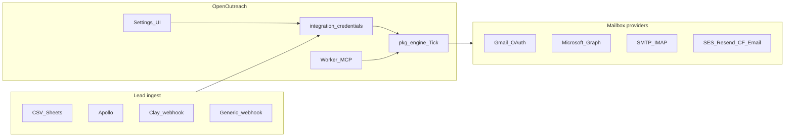

# Integrations depth roadmap

Product architecture and phased roadmap for lead sources, send providers, MCP depth, and a Settings surface that shows what is enabled and holds per-workspace credentials. Builds on open issues [#2](https://github.com/sdntsng/openoutreach/issues/2)–[#15](https://github.com/sdntsng/openoutreach/issues/15) without forking the `GWSClient` / engine invariants.

## Current state (baseline)

| Surface | Today |
|---------|--------|
| **Send** | Gmail OAuth, hosted SMTP/IMAP, Microsoft Graph OAuth (when `MICROSOFT_CLIENT_*` set). Resend/SES stubs (SES via SMTP endpoint). |
| **Leads** | CSV + Sheets + Apollo + Clay ingest + **suppressions** (honored on import) + **verify** (syntax/MX/disposable) + CSV export + `?q=` search. |
| **Settings** | Capabilities catalog, vault, **outbound webhook URL**, MCP/auth indicators. First-run checklist on Overview (`GET /api/v1/setup`). |
| **MCP** | Campaign tools + clone/PATCH + suppressions + setup + capabilities/integrations/Apollo/Sheets/draft/preflight/suggest-reply. |
| **Vault** | `google_credentials`, `microsoft_credentials`, `integration_credentials` (AES via `CREDENTIAL_ENCRYPTION_KEY`). |

**Default strategy (locked):** OpenOutreach is the **send + sequence engine**. Compete with Instantly/Smartlead; do **not** proxy send through them. Users bring Apollo/Clay/etc. for enrichment. Warmup is a later optional integration, not a v1 send path.



---

## 1. Lead sources (fetch / enrich)

**Principle:** Connector-open. Map everything into the existing lead row shape (email, name, company, domain, `custom_fields` JSON). No LinkedIn scraping in-product (ToS); accept Clay / PhantomBuster webhooks instead.

| Provider | Role | Typical cost (order of magnitude, public list) | Priority |
|----------|------|-----------------------------------------------|----------|
| **CSV / Google Sheets** | Baseline + scheduled sync | Free | P0 — [#11](https://github.com/sdntsng/openoutreach/issues/11) |
| **Generic webhook** | Any enrichment stack → OpenOutreach | Free (infra only) | P0 — [#11](https://github.com/sdntsng/openoutreach/issues/11) |
| **Clay** | Enrichment hub → signed ingest | ~$149–800+/mo (credits) | P0 — [#9](https://github.com/sdntsng/openoutreach/issues/9) |
| **Apollo.io** | People search + email reveal | ~$49–119/user/mo + credit burns on reveal | P1 — [#8](https://github.com/sdntsng/openoutreach/issues/8) |
| **Hunter / Prospeo / Findymail** | Email finder / verify | ~$49–399/mo | P2 |
| **Clearbit / HubSpot** | Enrich + CRM push | HubSpot free–enterprise; Clearbit often packaged | P2 |
| **ZoomInfo / Lusha** | Enterprise B2B DB | Often $10k+/yr | P3 / partner |
| **Sales Nav / Maps scrapers** | Via user tools → webhook only | SN ~$99/mo | Out of band |

**Cost UX:** Log enrichment calls (provider, units, timestamp) for credit visibility without becoming a billing system ([#6](https://github.com/sdntsng/openoutreach/issues/6)).

---

## 2. Send sources (mailboxes + warm providers)

### A. Own mailboxes (primary — compete Instantly)

| Provider | How | Reply path | Priority |
|----------|-----|------------|----------|
| **Gmail / Google Workspace** | Done (OAuth) | Gmail API poll | Done |
| **SMTP + IMAP** | Hosted UI/API over existing `smtp_imap` | IMAP poll in tick | P0 — [#4](https://github.com/sdntsng/openoutreach/issues/4) |
| **Microsoft 365 / Outlook** | Graph OAuth (`Mail.Send` + `Mail.Read`) implementing same send/poll contract as `GWSClient` | Graph poll | P1 — [#3](https://github.com/sdntsng/openoutreach/issues/3) |

Keep AGENTS.md invariant: **compose around `GWSClient`**. Do not invent a second parallel mail stack; extend routing in `internal/hosted/google_api.go` / tick provider switch in `internal/tick.go`. Epic: [#2](https://github.com/sdntsng/openoutreach/issues/2).

### B. Transactional API mailers (secondary)

Resend / SES / Postmark / Mailgun / **Cloudflare Email Sending** — good for high-volume domain send; weak for natural cold-inbox reputation and reply continuity. Ship after mailbox providers; require bounce webhook and/or inbound routing ([#5](https://github.com/sdntsng/openoutreach/issues/5)).

Typical cost: SES ~$0.10/1k emails; Resend ~$20/mo + usage; Cloudflare Email Sending (Workers Paid) 3,000 included/month then ~$0.35/1k. Sending to arbitrary recipients needs Workers Paid. Inbound Email Routing is unlimited.

### C. External warm email / Instantly-class

| Category | Examples | Stance |
|----------|----------|--------|
| **Competitors (full platforms)** | Instantly, Smartlead, Lemlist | Do **not** integrate as send backends. Position OpenOutreach as open alternative. |
| **Warmup networks** | Mailreach, Warmbox, Lemwarm, Instantly Warmup (standalone) | **P3:** optional warmup status link or API key that marks account health; warmup traffic stays outside `engine.Tick`. |
| **Infra / ESP** | Google Workspace + custom domain, Migadu, etc. | Documented via SMTP/IMAP connect. |

**Mailbox infra cost (rough):** Workspace mailbox ~$6–18/user/mo; warmup tools often ~$20–99/mailbox/mo.

---

## 3. MCP (already shipped — deepen)

**Exists today:** campaign CRUD, leads CSV/add, preview, activate (`confirm: true`), replies, blacklist — agent-safe create ≠ send.

**Next MCP depth** (epic [#10](https://github.com/sdntsng/openoutreach/issues/10)):

| Tool area | Issue | Notes |
|-----------|-------|-------|
| Connector search/enrich/import | [#12](https://github.com/sdntsng/openoutreach/issues/12) | Preview → draft campaign only |
| List/put/test/delete integrations (no secrets) | [#7](https://github.com/sdntsng/openoutreach/issues/7) | MCP twins of Settings vault CRUD |
| Draft sequence from brief | [#13](https://github.com/sdntsng/openoutreach/issues/13) | Draft-only |
| Reply triage / suggest | [#14](https://github.com/sdntsng/openoutreach/issues/14) | Send needs `confirm` |
| Preflight before activate | [#15](https://github.com/sdntsng/openoutreach/issues/15) | Non-mutating |
| Settings catalog | (new, small) | `outreach_list_capabilities` — which providers operator-enabled |

Parity rule: every Settings/Accounts action gets an MCP twin; tokens never returned.

---

## 4. Settings: capability catalog + credentials

Two layers (matches self-host + workspace model):

### Operator (deploy-time)

Env / Worker secrets / `container-env`, e.g.:

- `FEATURE_GMAIL=1` (default on when `GOOGLE_CLIENT_*` set)
- `FEATURE_MICROSOFT=0|1` + `MICROSOFT_CLIENT_ID/SECRET`
- `FEATURE_SMTP_IMAP=1`
- `FEATURE_RESEND=0|1`, `FEATURE_CF_EMAIL=0|1`, `FEATURE_SES=0|1`
- `FEATURE_APOLLO=1`, `FEATURE_CLAY=1`, …

Exposed read-only via `GET /api/v1/settings/capabilities` so UI can hide Connect Microsoft when not configured.

### Workspace (user)

Implement [#7](https://github.com/sdntsng/openoutreach/issues/7):

- Table `integration_credentials` (workspace_id, provider, name, encrypted_secret, metadata, status)
- Reuse `CREDENTIAL_ENCRYPTION_KEY` / vault pattern from `internal/hosted/vault.go`
- API: CRUD + `POST .../test` (never echo secrets)
- Expand `web/src/pages/SettingsPage.tsx` into sections:
  - **Workspace** (existing)
  - **Sending** — links to Accounts; shows which send providers are operator-enabled
  - **Integrations** — Apollo / Clay / webhook secrets; masked keys; Test connection
  - **MCP** — show whether bearer is configured (boolean only); copy endpoint URL
  - **Auth** — show `AUTH_MODE` (read-only from whoami/capabilities)

Accounts page stays the place to **connect mailboxes**; Settings owns **API keys and feature indicators**.

### Webhook ingest (Clay / generic)

`POST /api/v1/integrations/{clay|generic}/ingest?name=default`

Cloudflare Access bypasses this path. Optional HMAC: `X-OpenOutreach-Signature` or `X-Clay-Signature` = hex HMAC-SHA256 of the raw body using the stored webhook secret. Optional `Idempotency-Key` prevents duplicate imports on retries.

Target a campaign with `campaign_id` (query or body) **or** `campaign_name`. Set `create_campaign` / `create_if_missing` to open a **draft** campaign when the name is missing. Ingest **never activates**.

```http
POST /api/v1/integrations/clay/ingest
Content-Type: application/json
X-OpenOutreach-Signature: <hex hmac-sha256>
Idempotency-Key: clay-row-abc123

{"email":"ada@acme.com","first_name":"Ada","company":"Acme","campaign_name":"Q3 outbound","create_campaign":true}
```

Without `campaign_id` or a resolvable `campaign_name` the payload is preview-only. Clay HTTP API columns can POST the same JSON.

### OpenAPI (ingest)

```yaml
paths:
  /api/v1/integrations/{provider}/ingest:
    post:
      parameters:
        - in: path
          name: provider
          required: true
          schema: { type: string, enum: [clay, generic] }
        - in: query
          name: name
          schema: { type: string, default: default }
        - in: query
          name: campaign_id
          schema: { type: integer }
        - in: query
          name: campaign_name
          schema: { type: string }
        - in: query
          name: create_campaign
          schema: { type: boolean }
      requestBody:
        required: true
        content:
          application/json:
            schema:
              type: object
              properties:
                email: { type: string }
                first_name: { type: string }
                last_name: { type: string }
                company: { type: string }
                campaign_id: { type: integer }
                campaign_name: { type: string }
                create_campaign: { type: boolean }
                leads:
                  type: array
                  items: { type: object }
            examples:
              clay_column:
                value:
                  email: ada@acme.com
                  first_name: Ada
                  company: Acme
                  campaign_name: Q3 outbound
                  create_campaign: true
      responses:
        "200":
          description: Preview, import, or idempotent replay. status is never flipped to active.
```

Scheduled Google Sheets: store a `sheets` credential whose metadata is `{"url":"<sheet or csv url>","campaign_id":123}`. Hosted tick (Worker cron `*/2`) re-imports; existing campaign emails are skipped.

---

## 5. Implementation phases

**Phase 0 — Settings foundation (unblocks all connectors)**  
Schema + vault + capabilities API + Settings UI shell. Issue [#7](https://github.com/sdntsng/openoutreach/issues/7).

**Phase 1 — Send parity vs Instantly**  
Hosted SMTP/IMAP ([#4](https://github.com/sdntsng/openoutreach/issues/4)), then Microsoft Graph ([#3](https://github.com/sdntsng/openoutreach/issues/3)), formalize provider registry docs ([#2](https://github.com/sdntsng/openoutreach/issues/2)).

**Phase 2 — Lead ingest**  
Webhook + Sheets ([#11](https://github.com/sdntsng/openoutreach/issues/11)), Clay ([#9](https://github.com/sdntsng/openoutreach/issues/9)), Apollo ([#8](https://github.com/sdntsng/openoutreach/issues/8)), MCP enrich ([#12](https://github.com/sdntsng/openoutreach/issues/12)).

**Phase 3 — Agent depth**  
Sequence draft, reply triage, preflight ([#13](https://github.com/sdntsng/openoutreach/issues/13)–[#15](https://github.com/sdntsng/openoutreach/issues/15)); Mintlify MCP docs ([#21](https://github.com/sdntsng/openoutreach/issues/21)).

**Phase 4 — API mailers + warmup (deferred)**  
[#5](https://github.com/sdntsng/openoutreach/issues/5): Resend account (`FEATURE_RESEND=1`) is send-only via `GWSClient`; bounce webhook `POST /api/v1/integrations/resend/events`. Cloudflare Email Sending (`FEATURE_CF_EMAIL=1`) is the same `GWSClient` path (`POST /accounts/{account_id}/email/sending/send`); replies via Worker `email()` → `POST /api/v1/integrations/cf-email/inbound` (`X-Internal-Token`). SES remains the SMTP/IMAP path. Accounts list surfaces `reply_mode` (`oauth` / `imap` / `send_only` / `email_routing`) and `domain_verification` (`oauth` / `smtp` / `dns_at_provider` / `dns_at_cloudflare`). Warmup network ([#25](https://github.com/sdntsng/openoutreach/issues/25)) is a vault + capabilities flag + Accounts **status badge** (`healthy` / `unknown` / `error`) — **never** coupled to `engine.Tick`.

Do **not** add a wrangler `send_email` binding by default — deploy fails until Email Sending is onboarded. REST send from outreachd needs no binding.

---

## 6. Deliverables

1. This document (`docs/INTEGRATIONS.md`) — catalog + cost caveats + Instantly-is-competitor stance
2. Capabilities + vault API + Settings UI sections
3. Work through open issues in phase order; Warmup network filed as [#25](https://github.com/sdntsng/openoutreach/issues/25) under epic #2 non-goals

## Non-goals (near term)

- Building an Instantly/Smartlead compatibility API
- In-product LinkedIn scraping
- Multi-tenant SaaS billing for Apollo credits (users pay Apollo; we show usage logs)
- Replacing `GWSClient` with a greenfield `MailProvider` stack without re-exporting the same contract

---

## 7. Next ideas (researched, not scheduled)

Small follow-ups that fit the existing engine. Do not revisit Instantly-as-send-backend, LinkedIn scraping, or warmup-in-Tick.

### Easy integrations

| Idea | Why it's small | Caveat |
|------|----------------|--------|
| **Hunter / Prospeo** | Same vault + search preview as Apollo (`FEATURE_HUNTER` already in capabilities) | Credit UX only; users pay Hunter |
| **HubSpot CRM push** | Webhook-out on reply/classify; no send path | Keep create ≠ send |
| **Cloudflare DNS wizard** | After CF Email account add, call [DNS API](https://developers.cloudflare.com/dns/) to show missing SPF/DKIM for Email Sending | Needs a DNS:Edit token; never invent records the operator did not confirm |
| **Sheets scheduled sync** | Already re-imported on tick when a `sheets` credential has `campaign_id` | Document in Settings, don't add a second cron |

### UI fixes (ops console)

| Idea | Status |
|------|--------|
| Campaign list sent / replies / **Approx. opens** | Shipped on this branch |
| Account Pause / Resume | Shipped (API existed; dashboard + MCP twins) |
| Helpful empty states | Shipped on Campaigns / Accounts / Leads |
| DNS/SPF checklist on Accounts | Shipped — public MX / SPF / DMARC (no extra token) |
| Inbox empty: point at Email Routing if only `cf_email` accounts exist | Next |

### One-click setup / deploy

Already shipped:

- [Deploy to Cloudflare](https://deploy.workers.cloudflare.com/?url=https://github.com/sdntsng/openoutreach&dir=worker) button (new accounts only — forks + new Worker)
- Connect Git on the existing Worker: dashboard **Settings → Builds → Connect** → `sdntsng/openoutreach` (see [DEPLOYMENT.md](DEPLOYMENT.md) §B)
- `./scripts/deploy-cf.sh` (D1 default, secrets, container env, wrangler deploy)
- D1 as default storage (no Neon/Supabase required)

Worth adding later, in this order:

1. **`FEATURE_*` kill-switches** — Resend / CF Email / Hunter / warmup now **default on**. Set `FEATURE_*=0` only to hide a form. Vault credentials are still the real switch.
2. **Workers Builds on `dev`** (staging) — optional GitHub Action `workflow_dispatch` + `CLOUDFLARE_API_TOKEN`; production stays the existing Worker via dashboard Connect.
3. **Email Sending onboard checklist** in Settings: domain, SPF/DKIM, Routing rule → this Worker, `FEATURE_CF_EMAIL=1`. Still no `send_email` binding until the operator has onboarded Email Sending.
4. **Access setup script** already exists (`scripts/setup-cf-access.sh`). Surface a Settings copy-paste of bypass paths (`/t/*`, `/internal/*`, OAuth callbacks, Clay ingest).
5. Skip Railway/Fly/Heroku one-click unless someone is not on Cloudflare — the product's tick lock and Worker cron assume this topology.

SMTP alternative for Cloudflare Email Sending: `smtps://smtp.mx.cloudflare.net:465` user `api_token`. That is send-only (no IMAP). Prefer REST + Email Routing for this product so replies hit Inbox.
