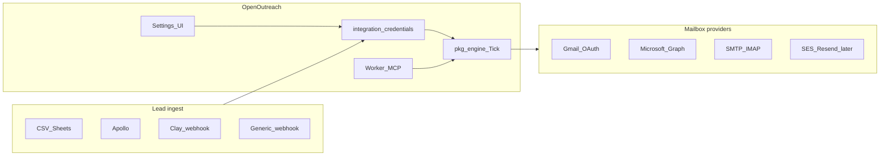

# Integrations depth roadmap

Product architecture and phased roadmap for lead sources, send providers, MCP depth, and a Settings surface that shows what is enabled and holds per-workspace credentials. Builds on open issues [#2](https://github.com/sdntsng/openoutreach/issues/2)–[#15](https://github.com/sdntsng/openoutreach/issues/15) without forking the `GWSClient` / engine invariants.

## Current state (baseline)

| Surface | Today |
|---------|--------|
| **Send** | Hosted: Gmail OAuth only (`GoogleAPIProvider` → `GWSClient`). Upstream CLI already has `smtp_imap`. |
| **Leads** | CSV paste/upload only (`ParseLeadsCSV` → `AddLeadsToCampaign`). |
| **Settings** | Read-only workspace ID in `web/src/pages/SettingsPage.tsx`. |
| **MCP** | Exists: `POST /mcp` + 17 tools in `worker/src/mcp.ts` / `docs/MCP.md`. No connector/enrich tools yet. |
| **Vault** | Google OAuth tokens only (`google_credentials`). No multi-provider API key table. |

**Default strategy (locked):** OpenOutreach is the **send + sequence engine**. Compete with Instantly/Smartlead; do **not** proxy send through them. Users bring Apollo/Clay/etc. for enrichment. Warmup is a later optional integration, not a v1 send path.

---

## 1. Lead sources (fetch / enrich)

**Principle:** Connector-open. Map everything into the existing lead row shape (email, name, company, domain, `custom_fields` JSON). No LinkedIn scraping in-product (ToS); accept Clay / PhantomBuster webhooks instead.

| Provider | Role | Typical cost (order of magnitude, public list) | Priority |
|----------|------|-----------------------------------------------|----------|
| **CSV / Google Sheets** | Baseline + scheduled sync | Free | P0 — [#11](https://github.com/sdntsng/openoutreach/issues/11) |
| **Generic webhook** | Any enrichment stack → OpenOutreach | Free (infra only) | P0 — [#11](https://github.com/sdntsng/openoutreach/issues/11) |
| **Clay** | Enrichment hub → signed ingest | ~$149–800+/mo (credits) | P0 — [#9](https://github.com/sdntsng/openoutreach/issues/9) |
| **Apollo.io** | People search + email reveal | ~$49–119/user/mo + credit burns on reveal | P1 — [#8](https://github.com/sdntsng/openoutreach/issues/8) |
| **Hunter / Prospeo / Findymail** | Email finder / verify | ~$49–399/mo | P2 |
| **Clearbit / HubSpot** | Enrich + CRM push | HubSpot free–enterprise; Clearbit often packaged | P2 |
| **ZoomInfo / Lusha** | Enterprise B2B DB | Often $10k+/yr | P3 / partner |
| **Sales Nav / Maps scrapers** | Via user tools → webhook only | SN ~$99/mo | Out of band |

**Cost UX:** Log enrichment calls (provider, units, timestamp) for credit visibility without becoming a billing system ([#6](https://github.com/sdntsng/openoutreach/issues/6)).

---

## 2. Send sources (mailboxes + warm providers)

### A. Own mailboxes (primary — compete Instantly)

| Provider | How | Reply path | Priority |
|----------|-----|------------|----------|
| **Gmail / Google Workspace** | Done (OAuth) | Gmail API poll | Done |
| **SMTP + IMAP** | Hosted UI/API over existing `smtp_imap` | IMAP poll in tick | P0 — [#4](https://github.com/sdntsng/openoutreach/issues/4) |
| **Microsoft 365 / Outlook** | Graph OAuth (`Mail.Send` + `Mail.Read`) implementing same send/poll contract as `GWSClient` | Graph poll | P1 — [#3](https://github.com/sdntsng/openoutreach/issues/3) |

Keep AGENTS.md invariant: **compose around `GWSClient`**. Do not invent a second parallel mail stack; extend routing in `internal/hosted/google_api.go` / tick provider switch in `internal/tick.go`. Epic: [#2](https://github.com/sdntsng/openoutreach/issues/2).

### B. Transactional API mailers (secondary)

Resend / SES / Postmark / Mailgun — good for high-volume domain send; weak for natural cold-inbox reputation and reply continuity. Ship after mailbox providers; require bounce webhook + optional send-only / no reply poll mode ([#5](https://github.com/sdntsng/openoutreach/issues/5)).

Typical cost: SES ~$0.10/1k emails; Resend ~$20/mo + usage.

### C. External warm email / Instantly-class

| Category | Examples | Stance |
|----------|----------|--------|
| **Competitors (full platforms)** | Instantly, Smartlead, Lemlist | Do **not** integrate as send backends. Position OpenOutreach as open alternative. |
| **Warmup networks** | Mailreach, Warmbox, Lemwarm, Instantly Warmup (standalone) | **P3:** optional warmup status link or API key that marks account health; warmup traffic stays outside `engine.Tick`. |
| **Infra / ESP** | Google Workspace + custom domain, Migadu, etc. | Documented via SMTP/IMAP connect. |

**Mailbox infra cost (rough):** Workspace mailbox ~$6–18/user/mo; warmup tools often ~$20–99/mailbox/mo.

---

## 3. MCP (already shipped — deepen)

**Exists today:** campaign CRUD, leads CSV/add, preview, activate (`confirm: true`), replies, blacklist — agent-safe create ≠ send.

**Next MCP depth** (epic [#10](https://github.com/sdntsng/openoutreach/issues/10)):

| Tool area | Issue | Notes |
|-----------|-------|-------|
| Connector search/enrich/import | [#12](https://github.com/sdntsng/openoutreach/issues/12) | Preview → draft campaign only |
| List/test integrations (no secrets) | [#7](https://github.com/sdntsng/openoutreach/issues/7) | |
| Draft sequence from brief | [#13](https://github.com/sdntsng/openoutreach/issues/13) | Draft-only |
| Reply triage / suggest | [#14](https://github.com/sdntsng/openoutreach/issues/14) | Send needs `confirm` |
| Preflight before activate | [#15](https://github.com/sdntsng/openoutreach/issues/15) | Non-mutating |
| Settings catalog | (new, small) | `outreach_list_capabilities` — which providers operator-enabled |

Parity rule: every Settings/Accounts action gets an MCP twin; tokens never returned.

---

## 4. Settings: capability catalog + credentials

Two layers (matches self-host + workspace model):

### Operator (deploy-time)

Env / Worker secrets / `container-env`, e.g.:

- `FEATURE_GMAIL=1` (default on when `GOOGLE_CLIENT_*` set)
- `FEATURE_MICROSOFT=0|1` + `MICROSOFT_CLIENT_ID/SECRET`
- `FEATURE_SMTP_IMAP=1`
- `FEATURE_APOLLO=1`, `FEATURE_CLAY=1`, …

Exposed read-only via `GET /api/v1/settings/capabilities` so UI can hide Connect Microsoft when not configured.

### Workspace (user)

Implement [#7](https://github.com/sdntsng/openoutreach/issues/7):

- Table `integration_credentials` (workspace_id, provider, name, encrypted_secret, metadata, status)
- Reuse `CREDENTIAL_ENCRYPTION_KEY` / vault pattern from `internal/hosted/vault.go`
- API: CRUD + `POST .../test` (never echo secrets)
- Expand `web/src/pages/SettingsPage.tsx` into sections:
  - **Workspace** (existing)
  - **Sending** — links to Accounts; shows which send providers are operator-enabled
  - **Integrations** — Apollo / Clay / webhook secrets; masked keys; Test connection
  - **MCP** — show whether bearer is configured (boolean only); copy endpoint URL
  - **Auth** — show `AUTH_MODE` (read-only from whoami/capabilities)

Accounts page stays the place to **connect mailboxes**; Settings owns **API keys and feature indicators**.

---

## 5. Implementation phases

**Phase 0 — Settings foundation (unblocks all connectors)**  
Schema + vault + capabilities API + Settings UI shell. Issue [#7](https://github.com/sdntsng/openoutreach/issues/7).

**Phase 1 — Send parity vs Instantly**  
Hosted SMTP/IMAP ([#4](https://github.com/sdntsng/openoutreach/issues/4)), then Microsoft Graph ([#3](https://github.com/sdntsng/openoutreach/issues/3)), formalize provider registry docs ([#2](https://github.com/sdntsng/openoutreach/issues/2)).

**Phase 2 — Lead ingest**  
Webhook + Sheets ([#11](https://github.com/sdntsng/openoutreach/issues/11)), Clay ([#9](https://github.com/sdntsng/openoutreach/issues/9)), Apollo ([#8](https://github.com/sdntsng/openoutreach/issues/8)), MCP enrich ([#12](https://github.com/sdntsng/openoutreach/issues/12)).

**Phase 3 — Agent depth**  
Sequence draft, reply triage, preflight ([#13](https://github.com/sdntsng/openoutreach/issues/13)–[#15](https://github.com/sdntsng/openoutreach/issues/15)); Mintlify MCP docs ([#21](https://github.com/sdntsng/openoutreach/issues/21)).

**Phase 4 — API mailers + warmup (deferred)**  
[#5](https://github.com/sdntsng/openoutreach/issues/5); separate warmup issue — status badge only, no tick coupling.

---

## 6. Deliverables

1. This document (`docs/INTEGRATIONS.md`) — catalog + cost caveats + Instantly-is-competitor stance
2. Capabilities + vault API + Settings UI sections
3. Work through open issues in phase order; file one Warmup network issue under epic #2 non-goals

## Non-goals (near term)

- Building an Instantly/Smartlead compatibility API
- In-product LinkedIn scraping
- Multi-tenant SaaS billing for Apollo credits (users pay Apollo; we show usage logs)
- Replacing `GWSClient` with a greenfield `MailProvider` stack without re-exporting the same contract
